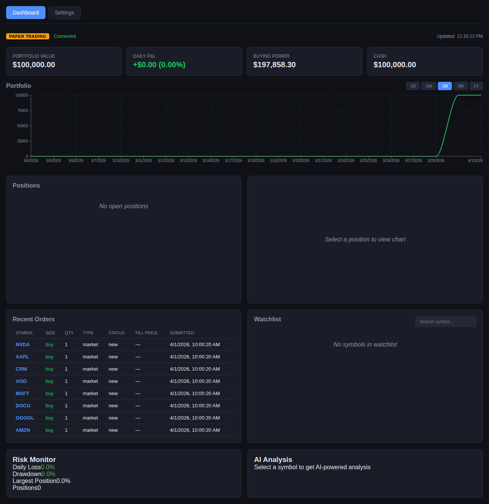

# Investing Agent

An AI-powered paper trading dashboard with real-time portfolio management, autonomous trading, risk controls, and Claude-powered trade analysis. Built with Electron, React, TypeScript, and the Alpaca API.



## Features

**Portfolio Dashboard**
- Real-time account overview: portfolio value, daily P&L, buying power, cash
- Interactive candlestick charts (via Lightweight Charts)
- Portfolio equity history with configurable timeframes (1D/1W/1M/3M/1Y)
- Positions table with live P&L tracking
- Order history with status tracking

**Autonomous Trading Agent**
- Three-tier strategy engine: Conservative (40%), Moderate (35%), Aggressive (25%)
- Sentiment analysis via Claude (cached, token-optimized)
- Technical indicators: RSI, MACD, volume analysis
- Market regime detection (bull/bear/sideways/crisis)
- Composite scoring system (-100 to +100) drives trade decisions
- Full activity feed and trade log with reasoning for every decision

**Trading**
- Market and limit orders with buy/sell support
- Order confirmation dialog with cost estimation
- Symbol search across all tradable assets
- Custom watchlist with live price quotes
- Cancel pending orders

**Risk Engine**
- Pre-trade validation against multiple risk limits
- Fractional Kelly Criterion position sizing
- 3% daily loss halt (auto-stops trading)
- 5% weekly drawdown pause
- 20% max drawdown kill switch
- 3% single position concentration limit
- 30% sector exposure cap
- Suggested quantity adjustments when limits are hit

**AI Trade Analysis**
- Claude-powered position analysis
- Buy/sell/hold recommendations with confidence levels
- Risk assessment and reasoning
- Suggested holding timeframes

## Getting Started

**New to Claude Code?** Follow the full [Setup Guide](SETUP.md#option-a-starting-from-scratch) -- covers everything from scratch on Windows.

**Already have Claude Code?** Jump to [Option B in the Setup Guide](SETUP.md#option-b-i-already-have-claude-code) -- just clone and run.

### Quick start (for experienced users)

```bash
git clone https://github.com/JoseLugo-AI/investing-agent.git
cd investing-agent
npm install

# Set up Alpaca paper trading keys
cat > ~/.alpaca-env << 'EOF'
ALPACA_KEY_ID=your-key-id
ALPACA_SECRET_KEY=your-secret-key
EOF

# Run the web dashboard
export $(cat ~/.alpaca-env | xargs)
npm run dev:web
# Open http://localhost:5010
```

Get your Alpaca keys (free) at [alpaca.markets](https://alpaca.markets) > Paper Trading > API Keys.

## Architecture

```
src/
  main/           # Backend (Electron main process / Express web server)
    alpaca-client    # Alpaca API wrapper
    risk-engine      # Pre-trade validation, Kelly sizing, drawdown tracking
    claude-analyzer  # AI trade analysis via Claude API
    agent-daemon     # Autonomous trading agent orchestration
    agent-scanner    # Per-tier market scanning
    agent-executor   # Decision-to-order execution via risk engine
    agent-store      # SQLite persistence for agent state
    web-server       # Express backend for web/browser mode
    ipc-handlers     # Shared handler logic (used by both Electron IPC and Express)
  renderer/        # Frontend (React)
    components/      # Dashboard, charts, order form, risk panel, AI analysis
    api.ts           # Auto-detects Electron IPC vs HTTP and routes accordingly
  shared/          # Constants, risk parameters, types
```

## Run Modes

**Web mode** (browser -- works anywhere):
```bash
export $(cat ~/.alpaca-env | xargs)
npm run dev:web
# Open http://localhost:5010
```

**Electron mode** (desktop app):
```bash
export $(cat ~/.alpaca-env | xargs)
npm run dev
```

**CLI mode** (terminal only):
```bash
export $(cat ~/.alpaca-env | xargs)
npx tsx cli.ts account
npx tsx cli.ts orders
npx tsx cli.ts buy AAPL 1
npx tsx cli.ts risk
npx tsx cli.ts analyze NVDA
```

## CLI Commands

| Command | Description |
|---------|-------------|
| `account` | Portfolio value, equity, cash, buying power, daily P&L |
| `positions` | Open positions with P&L |
| `orders` | Recent order history |
| `quote <SYMBOL>` | Real-time quote with bid/ask |
| `bars <SYMBOL> [timeframe]` | Price bars (1Min, 5Min, 1Hour, 1Day) |
| `search <QUERY>` | Search tradable assets |
| `history [period]` | Portfolio equity history |
| `buy <SYMBOL> <QTY> [limit]` | Place buy order |
| `sell <SYMBOL> <QTY> [limit]` | Place sell order |
| `cancel <ORDER_ID>` | Cancel pending order |
| `risk` | Risk dashboard (daily loss, drawdown, concentration) |
| `risk-check <SYMBOL> <QTY> <SIDE> [price]` | Pre-trade risk validation |
| `analyze <SYMBOL>` | Claude AI trade analysis |

## AI Analysis

The agent uses Claude for trade analysis and autonomous decision-making. It requires a Claude subscription (Pro or Max) and an active Claude Code login.

To enable standalone AI analysis in the dashboard or CLI:

```bash
export CLAUDE_API_KEY=your-anthropic-api-key
```

Or configure it in the Settings panel within the dashboard. The AI analyzer provides buy/sell/hold recommendations based on your positions, account state, and recent price action. This is for **educational purposes only** -- always do your own research.

## Risk Parameters

These are the default risk controls. They're intentionally conservative for learning:

| Parameter | Value | Purpose |
|-----------|-------|---------|
| Max capital per trade | 2% | Limits single-trade exposure |
| Daily loss halt | 3% | Stops trading for the day |
| Weekly drawdown pause | 5% | Pauses trading for the week |
| Max drawdown kill switch | 20% | Kills all trading |
| Max single position | 3% | Prevents overconcentration |
| Max sector exposure | 30% | Diversification guard |
| Kelly fraction | 0.5 | Half-Kelly for safety |

## Paper Trading to Live Trading

The app defaults to paper trading ($100K virtual money). When you're ready, it supports live trading through the same interface -- no code changes needed, just one environment variable.

### The Phases

**Phase 1: Paper Trading (default)**
Start here. Learn the mechanics -- order types, market hours, how fills work. Make mistakes with fake money. The risk engine is active so you learn what triggers it.

**Phase 2: Paper Trading with Track Record**
Same paper account, but now you're building history. Track your win rate, average gain/loss, and max drawdown over weeks. This data is what makes the Kelly Criterion position sizing meaningful -- without a real track record, it's just math with no signal.

**Phase 3: Live Trading**
When your paper track record shows consistent discipline, switch to real money:

```bash
export ALPACA_LIVE=true
export ALPACA_KEY_ID=your-live-key
export ALPACA_SECRET_KEY=your-live-secret
npm run dev:web
```

The risk engine becomes your safety net. The 3% daily loss halt and 20% kill switch protect real capital. Start small.

> The `ALPACA_LIVE=true` flag works across all modes: web dashboard, CLI, Electron, and MCP server. Without it, you're always in paper mode.

### Why This Matters

Most new traders lose money in their first year. Paper trading lets you compress that learning curve without the financial damage. The risk engine enforces the same discipline that professional traders use -- position sizing, loss limits, drawdown protection. By the time you switch to live, the guardrails are already muscle memory.

## Claude Code Integration

This project includes an MCP server so you can use it directly from Claude Code. See [`mcp-server/README.md`](mcp-server/README.md) for setup instructions.

## Tech Stack

- **Frontend:** React 18, TypeScript, Tailwind CSS v4, Lightweight Charts, Recharts
- **Backend:** Electron 30 / Express 5
- **Data:** Alpaca Markets API (paper trading)
- **AI:** Anthropic Claude (via Claude Code + API)
- **Storage:** better-sqlite3 (agent state, watchlist), Electron safeStorage (credentials)
- **Testing:** Vitest, React Testing Library
- **Build:** Vite, electron-builder

## Tests

```bash
npm test            # Run all tests
npm run test:watch  # Watch mode
```

## Building

```bash
npm run build          # Build renderer + main
npm run dist:win       # Build Windows .exe installer
```

## Disclaimer

This application defaults to **paper trading** (virtual money) through Alpaca's paper trading API. Live trading with real money is available by setting `ALPACA_LIVE=true`, but you do so at your own risk. The AI analysis feature provides educational insights only and should not be considered financial advice. The authors are not responsible for any financial losses. Always do your own research before making any real investment decisions.

## License

MIT
